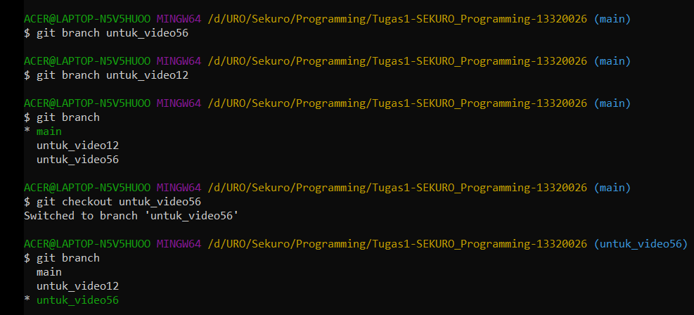
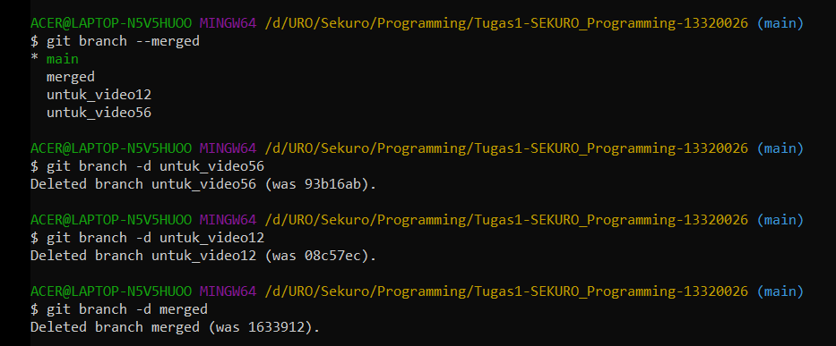

# Rangkuman Video 6

<p>&nbsp;</p>

## Penulis:
### Yosep Putra Setiyanto
### 13320026

<p>&nbsp;</p>
<p>&nbsp;</p>

## Branch & merge
.
### Gambaran Umum

Branch dan Merged disini sama persis seperti pada github hanya saja kali ini dilakukan dalam pc kita secaraa lokal menggunakan perintah perintah dari terminal  
.
### Menggunakan Branch dan Merge

- pada terminal git untuk membuat branch baru kita dapat mengetikan perintah

```
git branch <nama branch baru>
```
 
- untuk melihat semua branch yang ada dapat mengetikan perintah

```
git branch 
```

branch yang berwarna hijau berarti branch yang sedang aktif kerena head mengarah pada branch tersebut
 
- untuk pindah ke branch yang lain maka kita dapat mengetikan perintah

```
git checkout <nama branch>
```
### contoh screenshot:

 
- untuk menggabungkan dua branch dapat mengetikan perintah

```
git merge <nama branch yang ingin di merge>
```
 
- untuk mengecek branch apa saja yang telah di merged maka kita dapat mengetikan perintah

```
git branch --merged
```
### contoh screenshot:

 
- dan bila selesai melakukan merged untuk menghapus branch dapat mengetikan perintah

```
git branch -d <nama branch yang ingin dihapus>
```
### contoh screenshot:

 
<p>&nbsp;</p>